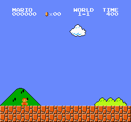
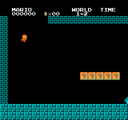

# Introduction

I have created a RL agent that uses PPO and EWC to learn how to play the first 2 levels of Super Mario Bros on NES.

I have trained the agent using two kinds of input: Image and RAM memory. I was inspired by [yumowei](https://github.com/yumouwei/super-mario-bros-reinforcement-learning).

Here is the result of the agent that has been trained using the RAM input:

Unfortunately, for the second level, the agent has learned much slower and wasn't able to converge to an optimal policy. If you want to read more about this project, you can access the following [link](https://www.overleaf.com/project/662e2d2d9d8b4f895a76e6b9)